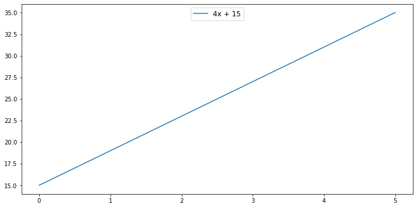
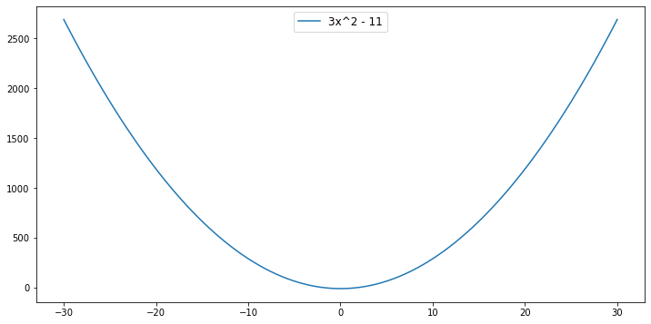

# Introduction to Derivatives - Lab

## Introduction
In this lab, we will practice our knowledge of derivatives. Remember that our key formula for derivatives, is 
$f'(x) = \dfrac{\Delta y}{\Delta x} =  \dfrac{f(x + \Delta x) - f(x)}{\Delta x}$.  So in driving towards this formula, we will do the following: 

1. Learn how to represent linear and nonlinear functions in code 
2. Then, because our calculation of a derivative relies on seeing the output at an initial value and the output at that value plus $\Delta x$, we need an `output_at` function
3. Then we will be able to code the $\Delta f$ function that sees the change in output between the initial $x$ and that initial $x$ plus the $\Delta x$ 
4. Finally, we will calculate the derivative at a given $x$ value, `derivative_at`

## Objectives 

You will be able to: 

- Use python functions to demonstrate derivatives of functions
- Describe what a derivative means in the context of a real-world example

## Let's begin: Starting with functions

### 1. Representing Functions

We are about to learn to take the derivative of a function in code.  But before doing so, we need to learn how to express any kind of function in code.  This way when we finally write our functions for calculating the derivative, we can use them with both linear and nonlinear functions.

For example, we want to write the function $f(x) = 2x^2 + 4x - 10 $ in a way that allows us to easily determine the exponent of each term.

This is our technique: write the formula as a numpy array. For example, for a function $f(x)= 7x^3$:

```python
arr = np.array([7, 3])
arr[0] # 7
arr[1] # 3
```

Take the following function as an example: 

$$f(x) = 4x^2 + 4x - 10 $$

We can use a [N-dimensional array](https://docs.scipy.org/doc/numpy-1.13.0/reference/arrays.ndarray.html) to represent this: 


```python
import numpy as np
array_1 = np.array([[4, 2], [4, 1], [-10, 0]])
```


```python
np.shape(array_1)
```


    (3, 2)


So each row in the `np.array` represents a different term in the function.  The first column is the term's constant and the second column is the term's exponent.  Thus $4x^2$ translates to `[4, 2]` and  $-10$ translates to `[-10, 0]` because $-10$ equals $-10*x^0$.  
> We'll refer to this `np.array` as "array of terms", or `array_of_terms`.

Ok, so give this a shot. Write $ f(x) = 4x^3 + 11x^2 $ as an array of terms.  Assign it to the variable `array_2`.


```python
array_2 = np.array([[4, 3], [11, 2]])
```

### 2. Evaluating a function at a specific point 

Now that we can represent a function in code, let's write a Python function called `term_output` that can evaluate what a single term equals at a value of $x$.  

* For example, when $x = 2$, the term $3x^2 = 3*2^2 = 12 $.  
* So we represent $3x^2$ in code as `(3, 2)`, and: 
* `term_output((3, 2), 2)` should return 12


```python
def term_output(array, input_value):
    return array[0]*input_value**array[1]
```


```python
term_output(np.array([3, 2]), 2) # 12
```


    12


> **Hint:** To raise a number to an exponent in python, like 3^2 use the double star, as in:
```python
3**2 # 9 
```

Now write a function called `output_at`, when passed an `array_of_terms` and a value of $x$, calculates the value of the function at that value.  
* For example, we'll use `output_at` to calculate $f(x) = 3x^2 - 11$.  
* Then `output_at([np.array([[3, 2], [-11, 0]]), 2)` should return $f(2) = 3*2^2 - 11 = 1$. Store `np.array([[3, 2], [-11, 0]])` as `array_3`.


```python
def output_at(array_of_terms, x_value):
    outputs = []
    for i in range(int(np.shape(array_of_terms)[0])):
        outputs.append(array_of_terms[i][0]*x_value**array_of_terms[i][1])
    return sum(outputs)
```


```python
array_3 = np.array([[3, 2], [-11, 0]])
```

Verify that $f(2) = 3*2^2 - 11 = 1$.


```python
output_at(array_3, 2) # 1 
```


    1


What value does $f(3)$ return?


```python
output_at(array_3, 3) # 16
```


    16


Now we can use our `output_at` function to display our function graphically.  We simply declare a list of `x_values` and then calculate `output_at` for each of the `x_values`.


```python
import numpy as np
import matplotlib.pyplot as plt

fig, ax = plt.subplots(figsize=(12,6))
x_values = np.linspace(-30, 30, 100)
y_values = list(map(lambda x: output_at(array_3, x), x_values))

plt.plot(x_values, y_values, label = "3x^2 - 11")

ax.legend(loc="upper center",fontsize='large')
plt.show()
```


## Moving to derivatives of linear functions

Let's start with a function, $f(x) = 4x + 15$.  We represent the function as the following:


```python
lin_function = np.array([[4, 1], [15, 0]])
```

We can plot the function by calculating outputs at a range of $x$ values.  Note that we use our `output_at` function to calculate the output at each individual $x$ value.


```python
fig, ax = plt.subplots(figsize=(12,6))
x_values = np.linspace(0, 5, 100)
y_values = list(map(lambda x: output_at(lin_function, x), x_values))

plt.plot(x_values, y_values, label = "4x + 15")

ax.legend(loc="upper center",fontsize='large')

plt.show()
```





Ok, time to do what we are here for: *derivatives*.  Remember that the derivative is the instantaneous rate of change of a function, and is expressed as:

$$ f'(x) = \frac{\Delta f}{\Delta x}  = \frac{f(x + \Delta x) - f(x)}{\Delta x}  $$ 

### Writing a function for $\Delta f$

We can see from the formula above that  $\Delta f = f(x + \Delta x ) - f(x) $.  Write a function called `delta_f` that, given a `list_of_terms`, an `x_value`, and a value $\Delta x $, returns the change in the output over that period.
> **Hint** Don't forget about the `output_at` function.  The `output_at` function takes a list of terms and an $x$ value and returns the corresponding output.  So really **`output_at` is equivalent to $f(x)$**, provided a function and a value of x.


```python
def delta_f(array_of_terms, x_value, delta_x):
    return output_at(array_of_terms, x_value + delta_x) - output_at(array_of_terms, x_value)
```


```python
delta_f(lin_function, 2, 1) # 4
```


    4


So for $f(x) = 4x + 15$, when $x$ = 2, and $\Delta x = 1$, $\Delta f$ is 4.  

### Plotting our function, delta f, and delta x  

Let's show $\Delta f$ and $\Delta x$ graphically.


```python
x_value = 2
delta_x = 1
```


```python
fig, ax = plt.subplots(figsize=(10,6))

x_values = np.linspace(0, 5, 100)
y_values = list(map(lambda x: output_at(lin_function, x), x_values))

plt.plot(x_values, y_values, label = "4x + 15")

# delta x
y_val = output_at(lin_function, x_value)
hline_lab= 'delta x = ' + str(delta_x)
plt.hlines(y=y_val, xmin= x_value, xmax= x_value + delta_x, color="lightgreen", label = hline_lab)

# delta f
y_val_max = output_at(lin_function, x_value + delta_x)
vline_lab =  'delta f = ' + str(y_val_max-y_val)
plt.vlines(x = x_value + delta_x , ymin= y_val, ymax=y_val_max, color="darkorange", label = vline_lab)
ax.legend(loc='upper left', fontsize='large')

plt.show()
```





### Calculating the derivative

Write a function, `derivative_at` that calculates $\dfrac{\Delta f}{\Delta x}$ when given a `array_of_terms`, an `x_value` for the value of $(x)$ the derivative is evaluated at, and `delta_x`, which represents $\Delta x$.  

Let's try this for $f(x) = 4x + 15 $.  Round the result to three decimal places.


```python
def derivative_of(array_of_terms, x_value, delta_x):
    delta = delta_f(array_of_terms, x_value, delta_x)
    return round(delta/delta_x, 3)
```

Now let's use this function along with our stored `x_value` and `delta_x`.


```python
derivative_of(lin_function, x_value=x_value, delta_x=delta_x) # 4.0
```


    4.0


### Building more plots

Ok, now that we have written a Python function that allows us to plot our list of terms, we can write a function called `tangent_line` that outputs the necessary terms to plot the slope of the function between initial $x$ and $x$ plus $\Delta x$. We'll walk you through this one.  


```python
def tangent_line(array_of_terms, x_value, line_length = 4, delta_x = .01):
    y = output_at(array_of_terms, x_value)
    derivative_at = derivative_of(array_of_terms, x_value, delta_x)
    
    x_dev = np.linspace(x_value - line_length/2, x_value + line_length/2, 50)
    tan = y + derivative_at *(x_dev - x_value)
    return {'x_dev':x_dev, 'tan':tan, 'lab': " f' (x) = " + str(derivative_at)}
```

> Our `tangent_line` function takes as arguments `list_of_terms`, `x_value`, which is where our line should be tangent to our function, `line_length` as the length of our tangent line, and `delta_x` which is our $\Delta x$.


> The return value of `tangent_line` is a dictionary that represents the tangent line at that value of $x$. It uses `output_at()` to calculate the function value at a particular $x$ and the `derivative_of()` function you wrote above to calculate the slope of the tangent line. 
Next, it uses `line_length` along with the `np.linspace` to generate an array of x-values to be used as an input to generate the tangent line `tan`.

Let's look at the output of the `tangent_line()`, using our `lin_function`,  $x$ equal to 2, $\Delta_x$ equal to 0.1 and `line_length` equal to 2.


```python
tan_line = tangent_line(lin_function, 2, line_length = 2, delta_x = .1)
tan_line
```


    {'lab': " f' (x) = 4.0",
     'tan': array([19.        , 19.16326531, 19.32653061, 19.48979592, 19.65306122,
            19.81632653, 19.97959184, 20.14285714, 20.30612245, 20.46938776,
            20.63265306, 20.79591837, 20.95918367, 21.12244898, 21.28571429,
            21.44897959, 21.6122449 , 21.7755102 , 21.93877551, 22.10204082,
            22.26530612, 22.42857143, 22.59183673, 22.75510204, 22.91836735,
            23.08163265, 23.24489796, 23.40816327, 23.57142857, 23.73469388,
            23.89795918, 24.06122449, 24.2244898 , 24.3877551 , 24.55102041,
            24.71428571, 24.87755102, 25.04081633, 25.20408163, 25.36734694,
            25.53061224, 25.69387755, 25.85714286, 26.02040816, 26.18367347,
            26.34693878, 26.51020408, 26.67346939, 26.83673469, 27.        ]),
     'x_dev': array([1.        , 1.04081633, 1.08163265, 1.12244898, 1.16326531,
            1.20408163, 1.24489796, 1.28571429, 1.32653061, 1.36734694,
            1.40816327, 1.44897959, 1.48979592, 1.53061224, 1.57142857,
            1.6122449 , 1.65306122, 1.69387755, 1.73469388, 1.7755102 ,
            1.81632653, 1.85714286, 1.89795918, 1.93877551, 1.97959184,
            2.02040816, 2.06122449, 2.10204082, 2.14285714, 2.18367347,
            2.2244898 , 2.26530612, 2.30612245, 2.34693878, 2.3877551 ,
            2.42857143, 2.46938776, 2.51020408, 2.55102041, 2.59183673,
            2.63265306, 2.67346939, 2.71428571, 2.75510204, 2.79591837,
            2.83673469, 2.87755102, 2.91836735, 2.95918367, 3.        ])}


Now, let's plot our function, $\Delta f$ and $\Delta x$ again along with our `rate_of_change` line.


```python
fig, ax = plt.subplots(figsize=(10,6))

x_values = np.linspace(0, 5, 100)
y_values = list(map(lambda x: output_at(lin_function, x), x_values))

plt.plot(x_values, y_values, label = "4x + 15")
# tangent_line
plt.plot(tan_line['x_dev'], tan_line['tan'], color = "yellow", label = tan_line['lab'])

# delta x
y_val = output_at(lin_function, x_value)
hline_lab= 'delta x = ' + str(delta_x)
plt.hlines(y=y_val, xmin= x_value, xmax= x_value + delta_x, color="lightgreen", label = hline_lab)

# delta f
y_val_max = output_at(lin_function, x_value + delta_x)
vline_lab =  'delta f = ' + str(y_val_max-y_val)
plt.vlines(x = x_value + delta_x , ymin= y_val, ymax=y_val_max, color="darkorange", label = vline_lab)
ax.legend(loc='upper left', fontsize='large')

plt.show()
```


So that function highlights the rate of change is moving at precisely the point $x = 2$. Sometimes it is useful to see how the derivative is changing across all $x$ values.  With linear functions, we know that our function is always changing by the same rate, and therefore the rate of change is constant.  Let's write a function that allows us to see the function and the derivative side by side.


```python
fig, ax = plt.subplots(figsize=(10,4))

x_values = np.linspace(0, 5, 100)
function_values = list(map(lambda x: output_at(lin_function, x),x_values))
derivative_values = list(map(lambda x: derivative_of(lin_function, x, delta_x), x_values))

# plot 1
plt.subplot(121)
plt.plot(x_values, function_values, label = "f (x)")
plt.legend(loc="upper left", bbox_to_anchor=[0, 1], ncol=2, fancybox=True)

# plot 2
plt.subplot(122)
plt.plot(x_values, derivative_values,color="darkorange", label = "f '(x)")
plt.legend(loc="upper left");

plt.show()
```


## Summary

In this section, we coded out our function for calculating and plotting the derivative.  We started by seeing how we can represent different types of functions.  Then we moved onto writing the `output_at` function which evaluates a provided function at a value of x.  We calculated `delta_f` by subtracting the output at initial x value from the output at that initial x plus delta x.  After calculating `delta_f`, we moved onto our `derivative_at` function, which simply divided `delta_f` from `delta_x`.  

In the final section, we plotted out some of our findings. We introduced the `tangent_line` function to get the slope for a function between an initial $x$, and $x + \Delta x $
